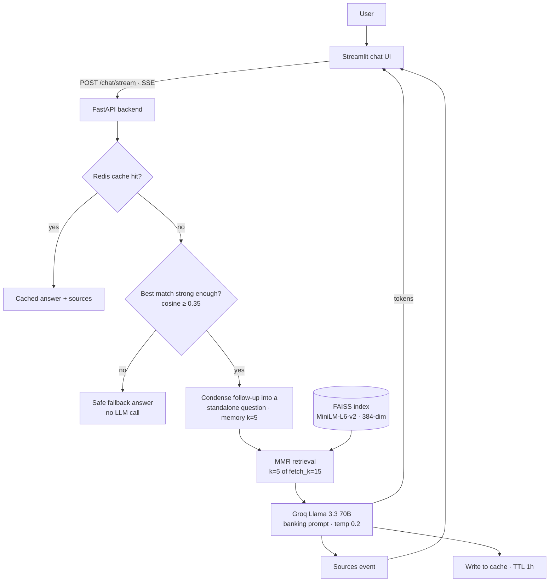

<div align="center">

# 🏦 BankAssist

### A streaming RAG chatbot for Indian banking support

**Ask about accounts, loans, cards, UPI, NEFT / RTGS, KYC or RBI rules. BankAssist retrieves the relevant policy
documents, answers with sources, streams the reply token by token, and remembers the conversation.**


[](LICENSE)

</div>

---

## Why BankAssist

Banking questions are repetitive (charges, limits, documents, eligibility), but the answers live in dozens of
policy documents that change over time. A plain LLM guesses numbers; a plain search box returns whole pages.

BankAssist combines both: it **retrieves the exact policy passages first**, then lets the LLM write a clear answer
from them, shows the sources, and is explicit when it falls back to general banking knowledge.

## Features

- 💬 **Chat UI** with sample questions, conversation history and a "clear conversation" button
- ⚡ **Token streaming** over Server-Sent Events: answers appear as they are generated
- 📄 **Source citations**: every answer shows the document snippets it was built from
- 🧠 **Conversation memory** per session (last 5 turns), so follow-ups like "and for NRIs?" work
- 🎯 **Diverse retrieval** with MMR (5 chunks out of 15 candidates) to avoid near-duplicate context
- 🛑 **Low-score fallback**: if nothing relevant is found, it answers with a safe message **without calling the LLM**
- 🚀 **Optional Redis cache** for repeated questions (1-hour TTL); runs fine without Redis
- 🩺 **Health endpoint** reporting index status and the number of indexed chunks
- ☁️ **Production deployment guide** for AWS EC2 (Nginx, systemd, Redis, swap)

## Knowledge base

**33 curated topics** (each as TXT and PDF), **853 indexed chunks**:

| Area | Topics |
|---|---|
| Accounts | savings, current, fixed deposit, recurring deposit |
| Loans | home, personal, education, vehicle, gold, business |
| Credit cards | basics, features, charges, security |
| Digital banking | UPI, NEFT / RTGS / IMPS, net & mobile banking, ATM / debit card |
| FAQ | account opening & KYC, banking charges, cheques & drafts, general banking |
| Policies | fraud protection, grievance redressal, RBI consumer rights |
| More | insurance (life, general), investments (mutual funds & demat, government schemes), NRI banking, MSME & trade finance |

## Architecture



**Index build:** `backend/build_index.py` loads every TXT / PDF in `data/`, cleans and splits it into 600-character
chunks (120 overlap), embeds them with `all-MiniLM-L6-v2` on CPU, and saves a FAISS index.

**Answer rules (prompt):** prefer the documents' own numbers and procedures; label anything from general knowledge
as *"Based on general banking knowledge"*; never invent bank-specific rates or fees; recommend confirming current
rates with the bank and consulting a relationship manager for personal advice.

## Tech stack

| Layer | Technology |
|---|---|
| Frontend | Streamlit (chat components, SSE client) |
| Backend | FastAPI, Pydantic, Uvicorn, `StreamingResponse` (SSE) |
| RAG | LangChain `ConversationalRetrievalChain`, window memory, custom prompts |
| Retrieval | FAISS, Hugging Face `sentence-transformers/all-MiniLM-L6-v2` |
| LLM | Groq, Llama 3.3 70B (`llama-3.3-70b-versatile`) |
| Cache | Redis (optional, graceful when absent) |
| Deployment | AWS EC2 (Ubuntu 24.04), Nginx reverse proxy, systemd services |

## Getting started

> **Model update:** Groq has since retired `llama-3.3-70b-versatile`, the model this project was built with. To run it today, set a current Groq model in `.env`, for example `GROQ_MODEL=openai/gpt-oss-120b` ([available models](https://console.groq.com/docs/models)).


**Requirements:** Python 3.10 - 3.12, a Groq API key, Redis (optional).

```bash
git clone https://github.com/ChetanMahajan715/bankassist-chatbot.git
cd bankassist-chatbot
python -m venv venv
# Windows: venv\Scripts\activate    macOS / Linux: source venv/bin/activate
pip install -r backend/requirements.txt
pip install -r frontend/requirements.txt

cp .env.example .env              # Windows PowerShell: Copy-Item .env.example .env
# set GROQ_API_KEY in .env

python -m backend.build_index --clean     # build the FAISS index from data/
```

Run (two terminals):
```bash
python -m uvicorn backend.app:app --host 127.0.0.1 --port 8000
streamlit run frontend/streamlit_app.py --server.address 127.0.0.1 --server.port 8501
```

Open **http://127.0.0.1:8501**. Health check: http://127.0.0.1:8000/health

```json
{ "status": "ok", "version": "1.0.0", "vectorstore_loaded": true, "docs_indexed": 853 }
```

### Try asking
- What is the daily UPI transaction limit?
- What is the difference between NEFT and RTGS?
- What documents do I need for a personal loan?
- How do I report a lost credit card?

## API

| Method | Endpoint | Description |
|---|---|---|
| `GET` | `/health` | Backend status, index loaded, number of chunks |
| `POST` | `/chat` | Full answer + sources as JSON (`cached` flag included) |
| `POST` | `/chat/stream` | Server-Sent Events: `{"token": ...}` events, then `{"sources": [...], "done": true}` |

```bash
curl -X POST http://127.0.0.1:8000/chat \
  -H "Content-Type: application/json" \
  -d "{\"query\":\"What documents are required for a personal loan?\"}"
```

<details>
<summary><b>Configuration (.env)</b></summary>

| Variable | Default | Purpose |
|---|---|---|
| `GROQ_API_KEY` | | Groq key (required) |
| `GROQ_MODEL` | `llama-3.3-70b-versatile` | LLM |
| `EMBEDDING_MODEL` | `sentence-transformers/all-MiniLM-L6-v2` | Embeddings |
| `VECTORSTORE_DIR` / `DATA_DIR` | `./Faiss_db` / `./data` | Index and documents |
| `RETRIEVAL_K` / `RETRIEVAL_FETCH_K` / `RETRIEVAL_LAMBDA` | `5` / `15` / `0.6` | MMR retrieval |
| `LOW_SCORE_THRESHOLD` | `0.35` | Below this similarity: fallback, no LLM call |
| `REDIS_HOST` / `REDIS_PORT` / `REDIS_TTL_SECONDS` | `localhost` / `6379` / `3600` | Optional cache |
| `API_URL` / `REQUEST_TIMEOUT_SECONDS` | `http://localhost:8000` / `60` | Frontend → backend |

</details>

## Project structure

```
BankAssist-Chatbot/
├── backend/
│   ├── app.py              # FastAPI: /health, /chat, /chat/stream (SSE)
│   ├── rag_pipeline.py     # embeddings, FAISS, MMR retriever, prompts, chain, low-score check
│   ├── ingestion.py        # load + clean + chunk TXT / PDF
│   ├── build_index.py      # build / refresh the FAISS index
│   ├── memory.py           # per-session window memory
│   ├── cache.py            # optional Redis cache
│   └── generate_pdfs.py    # PDF copies of the TXT knowledge base
├── frontend/
│   └── streamlit_app.py    # chat UI with streaming + sources
├── data/                   # 33 banking topics (TXT + PDF)
├── docs/architecture.md    # request flow and production topology
├── deployment_guide.md     # AWS EC2: Nginx, systemd, Redis, swap
└── .env.example
```

## Deployment

A step-by-step AWS EC2 guide covers the instance choice, swap for small instances, Nginx reverse proxy (with
buffering off for SSE), systemd services with auto-restart, optional Redis, and the real problems met during the
first deployment: **[deployment_guide.md](deployment_guide.md)** · Request flow: **[docs/architecture.md](docs/architecture.md)**

## Troubleshooting

| Problem | Fix |
|---|---|
| "Vector store not loaded" | `python -m backend.build_index --clean` |
| Frontend: API unreachable | Start the backend; check `API_URL` in `.env` |
| Missing Groq key | Set `GROQ_API_KEY` in `.env` |
| Redis warning | Not fatal: start Redis for caching, or ignore |

## Possible improvements
- Evaluation set with answer accuracy and retrieval hit-rate numbers
- Hybrid search (BM25 + vectors) for exact terms such as "IFSC" or form names
- Multilingual answers (Hindi and regional languages)

## Author

**Chetan Mahajan** · AI / ML engineer

[](https://github.com/ChetanMahajan715)
[](https://www.linkedin.com/in/chetanmahajan715/)

## License
[MIT](LICENSE)
